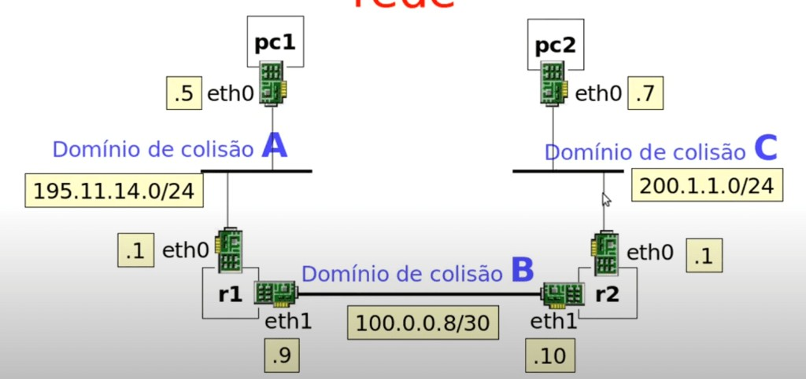

# Lab 1 — Roteamento estático

Primeiro laboratório da disciplina **Laboratório de Sistemas Operacionais e Redes**, Instituto Federal de Alagoas (IFAL), oferta **2026.1**, ministrada pelo **prof. Breno Jacinto**.

O lab simula uma rede com dois roteadores e dois PCs em três domínios de colisão, com endereçamento e rotas estáticas configurados via Kathará.

## Topologia

A figura abaixo mostra os três domínios de colisão e o endereçamento das interfaces.



- **Domínio de colisão A** — Rede `195.11.14.0/24`: `pc1` (eth0: 195.11.14.5) e `r1` (eth0: 195.11.14.1).
- **Domínio de colisão B** — Rede `100.0.0.8/30` (enlace entre roteadores): `r1` (eth1: 100.0.0.9) e `r2` (eth1: 100.0.0.10).
- **Domínio de colisão C** — Rede `200.1.1.0/24`: `r2` (eth0: 200.1.1.1) e `pc2` (eth0: 200.1.1.7).

## Como executar

Na pasta do lab:

```bash
kathara lstart
```

Para encerrar:

```bash
kathara lclean
```

## Configuração

- **pc1** e **pc2**: IP na interface eth0 e rota default via o roteador da respectiva rede (195.11.14.1 e 200.1.1.1).
- **r1** e **r2**: IPs nas duas interfaces e rotas estáticas com `ip route add ... via ...` para as redes remotas.

Com isso, `pc1` e `pc2` conseguem se comunicar (por exemplo, `ping 200.1.1.7` a partir do pc1).
