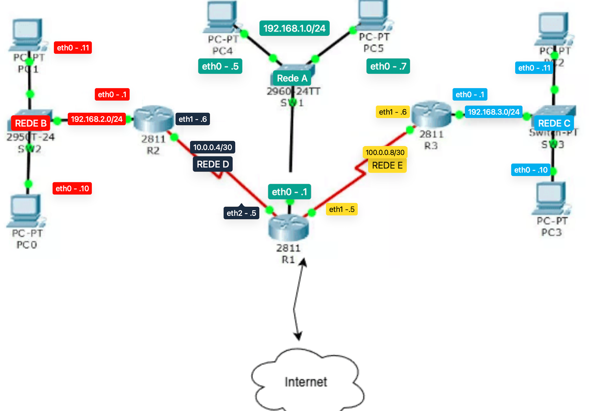
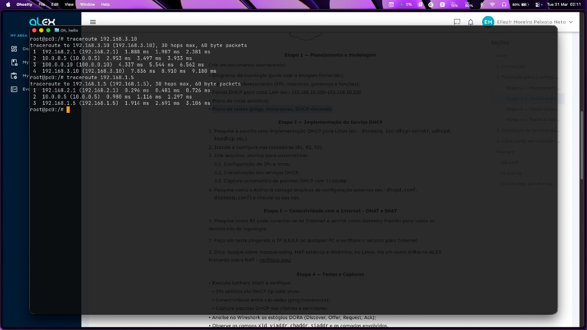

## Topologia

---

## Etapa 1 - Planejamento e Modelagem

Crie um documento descrevendo:

1. Diagrama da topologia (imagem acima).
2. Tabela de enderecamento (IPs, mascaras, gateways e funcoes).
3. Faixas DHCP para cada LAN (ex.: `192.168.10.100-192.168.10.200`).
4. Plano de rotas estaticas.
5. Plano de testes (ping, traceroute, DHCP discover).

### Tabela de Enderecamento

| Dispositivo | Interface | Rede   | Endereco IP/CIDR | Mascara Decimal | Gateway Padrao | Funcao                            |
|---|---|---|---|---|---|---|
| R1  | eth0 | Rede A | 192.168.1.1/24   | 255.255.255.0   | -             | Gateway da LAN A                  |
| R1  | eth1 | Rede E | 100.0.0.9/30     | 255.255.255.252 | -             | Enlace com R3 |
| R1  | eth2 | Rede D | 10.0.0.5/30      | 255.255.255.252 | -             | Enlace com R2                     |
| R2  | eth0 | Rede B | 192.168.2.1/24   | 255.255.255.0   | -             | Gateway da LAN B                  |
| R2  | eth1 | Rede D | 10.0.0.6/30      | 255.255.255.252 | -             | Enlace com R1                     |
| R3  | eth0 | Rede C | 192.168.3.1/24   | 255.255.255.0   | -             | Gateway da LAN C                  |
| R3  | eth1 | Rede E | 100.0.0.10/30    | 255.255.255.252 | -             | Enlace com R1                     |
| PC4 | eth0 | Rede A | DHCP             | 255.255.255.0   | 192.168.1.1   | Host da LAN A                     |
| PC5 | eth0 | Rede A | DHCP             | 255.255.255.0   | 192.168.1.1   | Host da LAN A                     |
| PC0 | eth0 | Rede B | DHCP             | 255.255.255.0   | 192.168.2.1   | Host da LAN B                     |
| PC1 | eth0 | Rede B | DHCP             | 255.255.255.0   | 192.168.2.1   | Host da LAN B                     |
| PC2 | eth0 | Rede C | DHCP             | 255.255.255.0   | 192.168.3.1   | Host da LAN C                     |
| PC3 | eth0 | Rede C | DHCP             | 255.255.255.0   | 192.168.3.1   | Host da LAN C                     |

### Faixas DHCP por LAN

| LAN | Sub-rede | Gateway | Faixa DHCP sugerida |
|---|---|---|---|
| Rede A | 192.168.1.0/24 | 192.168.1.1 | 192.168.1.100-192.168.1.200 |
| Rede B | 192.168.2.0/24 | 192.168.2.1 | 192.168.2.100-192.168.2.200 |
| Rede C | 192.168.3.0/24 | 192.168.3.1 | 192.168.3.100-192.168.3.200 |

> Redes D (10.0.0.4/30) e E (100.0.0.8/30) sao enlaces ponto a ponto entre roteadores e nao usam DHCP.

### Plano de Rotas Estaticas
| Dispositivo | Rede | Gateway |
|---|---|---|
| R1 | 192.168.2.0/24 | 10.0.0.5 |
| R1 | 192.168.3.0/24 | 100.0.0.10 |
| R2 | 192.168.1.0/24 | 10.0.0.6 |
| R2 | 192.168.3.0/24 | 10.0.0.5 |
| R3 | 192.168.1.0/24 | 100.0.0.9 |
| R3 | 192.168.2.0/24 | 100.0.0.9 |
---

### Evidencia - Traceroute entre LANs

Testes executados:
- `traceroute 192.168.3.10` (de `pc0` para `pc2`)
- `traceroute 192.168.1.5` (de `pc0` para `pc4`)

Resultado:
- O caminho exibido confirma a passagem pelos roteadores esperados entre as sub-redes, validando o plano de rotas estaticas.

## Etapa 2 - Implementacao do Servico DHCP

- Pesquise e escolha uma implementacao DHCP para Linux (ex.: `dnsmasq`, `isc-dhcp-server`, `udhcpd`, `kea`).
- Instale e configure nos roteadores (`R1`, `R2`, `R3`).
- Crie arquivos `.startup` para automatizar:
  - Configuracao de IPs e rotas;
  - Inicializacao dos servicos DHCP;
  - Captura automatica de pacotes DHCP com `tcpdump`.
- Pesquise como o Kathara carrega arquivos de configuracao externos (ex.: `dhcpd.conf`, `dnsmasq.conf`) e vincule-os aos nos.

---

## Etapa 3 - Conectividade com a Internet (DNAT e SNAT)

1. Pesquise como o R1 pode conectar-se à Internet e servir como **Gateway Padrão** para todos os demais nós da topologia.
2. Faça um teste pingando o IP `8.8.8.8` de qualquer PC e verifique o retorno para a Internet.
3. Dica: busque sobre masquerading, NAT estático e dinâmico no Linux. Há outra trilha no ALEX tratando sobre NAT — verifique lá.

## Etapa 4 - Testes e Capturas

- Execute `kathara lstart` e verifique:
  - IPs obtidos via DHCP (`ip addr show`);
  - Conectividade entre sub-redes (`ping`/`traceroute`).
- Capture pacotes DHCP nos clientes e servidores.
- Analise no Wireshark os estagios DORA (Discover, Offer, Request, Ack).
- Observe os campos `xid`, `yiaddr`, `chaddr`, `siaddr` e as camadas envolvidas.

---

## Checklist de Progresso

### Etapa 1 - Planejamento e Modelagem
- [x] Diagrama da topologia inserido
- [x] Tabela de enderecamento
- [x] Faixas DHCP por LAN
- [x] Plano de rotas estaticas
- [x] Plano de testes definido

### Etapa 2 - Implementacao do DHCP
- [x] Implementacao escolhida (`dnsmasq`)
- [x] `dnsmasq` configurado em `R1`, `R2` e `R3`
- [x] Arquivos externos em `shared/dnsmasq-r1.conf`, `shared/dnsmasq-r2.conf`, `shared/dnsmasq-r3.conf`
- [x] Startups automatizados (IPs, rotas, DHCP)
- [x] Captura DHCP automatica com `tcpdump` em clientes e servidores
- [x] DHCP validado com DORA nas redes A, B e C

### Etapa 3 - Internet (DNAT/SNAT)
- [x] `R1` com `ip_forward=1`
- [x] Regras NAT/MASQUERADE adicionadas no `R1` (interface WAN detectada em runtime)
- [x] Rotas default adicionadas em `R2` e `R3` apontando para `R1`
- [ ] Teste de conectividade para Internet (`ping 8.8.8.8`) a partir de um PC

### Etapa 4 - Testes e Capturas
- [x] Evidencia de `traceroute` entre sub-redes
- [x] Capturas `.pcap` de DHCP geradas em `/shared/captures`
- [ ] Abrir capturas no Wireshark e evidenciar estagios DORA
- [ ] Documentar analise dos campos `xid`, `yiaddr`, `chaddr`, `siaddr`

